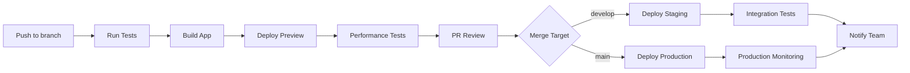

# Ticket #0031: Setup CI/CD Pipeline - Pipeline de Integración Continua

**Estado:** 📋 Planificado  
**Prioridad:** Alta  
**Estimación:** 1 día  
**Fase:** 7 - Testing y Despliegue  
**Asignado a:** TBD  

---

## 📋 Descripción

Implementar pipeline completo de CI/CD para el marketplace Kalos E-commerce, automatizando testing, building, deployment y monitoreo usando GitHub Actions y Firebase Hosting con preview channels.

## 🎯 Objetivos

### Funcionales
- Automatización completa de testing en cada PR
- Deploy automático a staging en merge a develop
- Deploy automático a producción en merge a main
- Preview deployments para cada PR
- Notificaciones de estado de deploy
- Rollback automático en caso de fallos

### Técnicos
- GitHub Actions workflows optimizados
- Firebase Hosting con preview channels
- Artifact caching para builds rápidos
- Secret management seguro
- Monitoring y alertas post-deploy
- Integración con Lighthouse CI

## 🔧 Tareas Técnicas

### GitHub Actions Setup
- [ ] Crear workflow principal de CI
- [ ] Configurar workflow de deploy a staging
- [ ] Configurar workflow de deploy a producción
- [ ] Setup de preview deployments
- [ ] Configurar caching de dependencias
- [ ] Setup de notifications (Slack/Discord)

### Firebase Configuration
- [ ] Configurar hosting targets (prod/staging)
- [ ] Setup preview channels automáticos
- [ ] Configurar reglas de security para deploy
- [ ] Setup de environment variables
- [ ] Configurar rollback policies

### Quality Gates
- [ ] Tests obligatorios antes de merge
- [ ] Performance budget enforcement
- [ ] Security scanning automatizado
- [ ] Dependency vulnerability scanning
- [ ] Code quality checks con SonarCloud

## 🔄 Pipeline Architecture



## 📝 GitHub Actions Workflows

### 1. CI Workflow (.github/workflows/ci.yml)
```yaml
name: Continuous Integration

on:
  pull_request:
    branches: [develop, main]
  push:
    branches: [develop, main]

jobs:
  test:
    runs-on: ubuntu-latest
    
    steps:
      - name: Checkout code
        uses: actions/checkout@v4
        
      - name: Setup Node.js
        uses: actions/setup-node@v4
        with:
          node-version: '18'
          cache: 'npm'
          
      - name: Install dependencies
        run: npm ci
        
      - name: Run linting
        run: npm run lint
        
      - name: Run unit tests
        run: npm run test:unit
        
      - name: Run integration tests
        run: npm run test:integration
        
      - name: Build application
        run: npm run build
        
      - name: Upload build artifacts
        uses: actions/upload-artifact@v4
        with:
          name: dist
          path: dist/
          
  e2e-tests:
    runs-on: ubuntu-latest
    needs: test
    
    steps:
      - name: Checkout code
        uses: actions/checkout@v4
        
      - name: Setup Node.js
        uses: actions/setup-node@v4
        with:
          node-version: '18'
          cache: 'npm'
          
      - name: Install dependencies
        run: npm ci
        
      - name: Start Firebase Emulators
        run: npm run emulators:start &
        
      - name: Run E2E tests
        run: npm run test:e2e
        
      - name: Upload test results
        uses: actions/upload-artifact@v4
        if: always()
        with:
          name: test-results
          path: test-results/
          
  security-scan:
    runs-on: ubuntu-latest
    
    steps:
      - name: Checkout code
        uses: actions/checkout@v4
        
      - name: Run security audit
        run: npm audit --audit-level high
        
      - name: Dependency vulnerability scan
        uses: snyk/actions/node@master
        env:
          SNYK_TOKEN: ${{ secrets.SNYK_TOKEN }}
```

### 2. Preview Deploy Workflow (.github/workflows/preview.yml)
```yaml
name: Preview Deployment

on:
  pull_request:
    branches: [develop, main]
    types: [opened, synchronize]

jobs:
  deploy-preview:
    runs-on: ubuntu-latest
    
    steps:
      - name: Checkout code
        uses: actions/checkout@v4
        
      - name: Setup Node.js
        uses: actions/setup-node@v4
        with:
          node-version: '18'
          cache: 'npm'
          
      - name: Install dependencies
        run: npm ci
        
      - name: Build for preview
        run: npm run build
        env:
          VITE_FIREBASE_PROJECT: kalos-dev
          VITE_ENVIRONMENT: preview
          
      - name: Deploy to Firebase Preview
        uses: FirebaseExtended/action-hosting-deploy@v0
        with:
          repoToken: '${{ secrets.GITHUB_TOKEN }}'
          firebaseServiceAccount: '${{ secrets.FIREBASE_SERVICE_ACCOUNT }}'
          projectId: kalos-dev
          
      - name: Run Lighthouse CI
        uses: treosh/lighthouse-ci-action@v10
        with:
          urls: ${{ steps.firebase-deploy.outputs.details_url }}
          configPath: './.lighthouserc.json'
          uploadArtifacts: true
          temporaryPublicStorage: true
```

### 3. Production Deploy Workflow (.github/workflows/deploy.yml)
```yaml
name: Production Deployment

on:
  push:
    branches: [main]

jobs:
  deploy-production:
    runs-on: ubuntu-latest
    environment: production
    
    steps:
      - name: Checkout code
        uses: actions/checkout@v4
        
      - name: Setup Node.js
        uses: actions/setup-node@v4
        with:
          node-version: '18'
          cache: 'npm'
          
      - name: Install dependencies
        run: npm ci
        
      - name: Run full test suite
        run: |
          npm run test:unit
          npm run test:integration
          npm run test:e2e
          
      - name: Build for production
        run: npm run build
        env:
          VITE_FIREBASE_PROJECT: kalos-prod
          VITE_ENVIRONMENT: production
          
      - name: Deploy to Firebase Production
        uses: FirebaseExtended/action-hosting-deploy@v0
        with:
          repoToken: '${{ secrets.GITHUB_TOKEN }}'
          firebaseServiceAccount: '${{ secrets.FIREBASE_SERVICE_ACCOUNT_PROD }}'
          projectId: kalos-prod
          channelId: live
          
      - name: Post-deploy health check
        run: |
          curl -f https://kalos.com/health || exit 1
          
      - name: Notify deployment success
        uses: 8398a7/action-slack@v3
        with:
          status: success
          text: '🚀 Kalos E-commerce deployed successfully to production!'
        env:
          SLACK_WEBHOOK_URL: ${{ secrets.SLACK_WEBHOOK }}
          
      - name: Notify on failure
        uses: 8398a7/action-slack@v3
        if: failure()
        with:
          status: failure
          text: '❌ Kalos E-commerce deployment failed!'
        env:
          SLACK_WEBHOOK_URL: ${{ secrets.SLACK_WEBHOOK }}
```

## ⚙️ Configuration Files

### Firebase Config (firebase.json)
```json
{
  "hosting": [
    {
      "target": "production",
      "public": "dist",
      "ignore": ["firebase.json", "**/.*", "**/node_modules/**"],
      "rewrites": [
        {
          "source": "**",
          "destination": "/index.html"
        }
      ],
      "headers": [
        {
          "source": "**/*.@(js|css)",
          "headers": [
            {
              "key": "Cache-Control",
              "value": "max-age=31536000"
            }
          ]
        }
      ]
    },
    {
      "target": "staging", 
      "public": "dist",
      "ignore": ["firebase.json", "**/.*", "**/node_modules/**"],
      "rewrites": [
        {
          "source": "**",
          "destination": "/index.html"
        }
      ]
    }
  ],
  "emulators": {
    "auth": {
      "port": 9099
    },
    "firestore": {
      "port": 8080
    },
    "storage": {
      "port": 9199
    },
    "hosting": {
      "port": 5000
    }
  }
}
```

### Lighthouse CI Config (.lighthouserc.json)
```json
{
  "ci": {
    "collect": {
      "numberOfRuns": 3,
      "settings": {
        "preset": "desktop"
      }
    },
    "assert": {
      "assertions": {
        "categories:performance": ["error", {"minScore": 0.9}],
        "categories:accessibility": ["error", {"minScore": 0.9}],
        "categories:best-practices": ["error", {"minScore": 0.9}],
        "categories:seo": ["error", {"minScore": 0.9}]
      }
    },
    "upload": {
      "target": "temporary-public-storage"
    }
  }
}
```

## 🧪 Criterios de Aceptación

### Pipeline Functionality
- [ ] Tests se ejecutan automáticamente en cada PR
- [ ] Preview deployments se crean para cada PR
- [ ] Deploy a staging automático en merge a develop
- [ ] Deploy a producción automático en merge a main
- [ ] Rollback automático en caso de health check failure

### Quality Gates
- [ ] No merge sin tests passing
- [ ] Performance budget enforced (Lighthouse >90)
- [ ] Security vulnerabilities bloquean deploy
- [ ] Code coverage mínimo requerido (90%)
- [ ] Dependency vulnerabilities escaneadas

### Monitoring & Notifications
- [ ] Notifications en Slack para deploys exitosos/fallidos
- [ ] Monitoring post-deploy funcional
- [ ] Alertas automáticas en caso de errors en producción
- [ ] Métricas de deploy time y success rate
- [ ] Logs centralizados y accesibles

### Performance
- [ ] Pipeline completo <10 minutos
- [ ] Caching efectivo de dependencias
- [ ] Builds paralelos donde sea posible
- [ ] Artifact reuse entre jobs
- [ ] Resource utilization optimizada

## 📝 Notas de Implementación

### Environment Variables
```bash
# GitHub Secrets requeridos
FIREBASE_SERVICE_ACCOUNT         # Service account para dev/staging
FIREBASE_SERVICE_ACCOUNT_PROD    # Service account para producción
SLACK_WEBHOOK                    # Webhook para notificaciones
SNYK_TOKEN                       # Token para security scanning
LIGHTHOUSE_TOKEN                 # Token para Lighthouse CI
```

### Branch Protection Rules
```yaml
# Configuración recomendada para main branch
protection_rules:
  main:
    required_status_checks:
      - "test"
      - "e2e-tests" 
      - "security-scan"
    enforce_admins: true
    required_pull_request_reviews:
      required_approving_review_count: 2
      dismiss_stale_reviews: true
    restrictions:
      users: []
      teams: ["developers", "tech-leads"]
```

### Performance Monitoring
```javascript
// scripts/health-check.js
const healthCheck = async () => {
  const checks = [
    { name: 'Homepage', url: '/', expected: 200 },
    { name: 'API Health', url: '/api/health', expected: 200 },
    { name: 'Search', url: '/buscar', expected: 200 },
    { name: 'Admin', url: '/admin', expected: 200 }
  ];
  
  for (const check of checks) {
    const response = await fetch(`${BASE_URL}${check.url}`);
    if (response.status !== check.expected) {
      throw new Error(`${check.name} health check failed`);
    }
  }
  
  console.log('All health checks passed ✅');
};
```

## 🔗 Dependencias

### Técnicas
- ✅ Repository en GitHub configurado
- ✅ Firebase projects (dev/prod) configurados
- ⚠️ Service accounts con permisos apropiados
- ⚠️ Testing framework completo (#0030)

### Servicios Externos
- ⚠️ Slack workspace para notifications
- ⚠️ Snyk account para security scanning
- ⚠️ Lighthouse CI token
- ⚠️ Domain configurado para producción

## 🚀 Criterios de Deploy

- [ ] All workflows ejecutan exitosamente
- [ ] Preview deployments funcionan correctamente
- [ ] Production deployment tested en staging
- [ ] Rollback procedure validado
- [ ] Team training completado en nuevo pipeline

---

**Tags:** `cicd` `github-actions` `firebase` `automation` `deployment`  
**Relacionado:** #0030, #0032
